# HealthDrop Surveillance System

HealthDrop is an advanced, AI-powered disease surveillance and health management application built with React Native and Expo. The platform is designed to provide real-time monitoring, risk assessment, and actionable insights for public health management. It features a "Liquid Glass" inspired UI with dark/light theme support.

## 🚀 Features

* **Real-time Dashboard**: Comprehensive overview of national and regional health statistics.
* **Interactive Maps**: Heatmaps and categorized location mapping for hotspots and healthcare facilities using React Native Maps and Leaflet.
* **Risk Heatmap & Analysis**: Visual representation of health risks by region with detailed AI-driven explanatory panels.
* **Self-Assessment**: Built-in tools for users to evaluate their health status.
* **Proximity Stats**: Aarogya Setu-style proximity tracking for disease exposure risk.
* **Telemedicine & Hygiene Education**: Integrated modules for remote consultation and public health education.
* **Field Worker Logistics**: Dedicated tools for field health workers.
* **Theming**: Advanced 'Liquid Glass' UI with full light and dark mode support via Context API.
* **Authentication**: Dummy authentication flow for demonstration purposes with profile setup.

## 🛠️ Technology Stack

* **Framework**: [React Native](https://reactnative.dev/)
* **Build Tool**: [Expo](https://expo.dev/)
* **Navigation**: Expo Router / Custom Navigation (App.tsx based)
* **Maps**: `react-native-maps`, `react-leaflet`, `@react-google-maps/api`
* **Icons**: `@expo/vector-icons`
* **Storage**: `@react-native-async-storage/async-storage`
* **Backend/Auth Integration**: `@supabase/supabase-js` (prepared for integration)

## 📦 Project Structure

```text
├── App.tsx                 # Main application entry point and navigation setup
├── app.json                # Expo configuration
├── assets/                 # Images, icons, and fonts
├── components/             # Reusable UI components
│   ├── AuthScreen.tsx      # Login interface
│   ├── Card.tsx            # Generic card component
│   ├── HotspotMap.tsx      # Interactive map for disease hotspots
│   ├── RiskHeatmap.tsx     # Regional risk visualization
│   └── ...                 # Other modular components
├── lib/                    # Utilities and context
│   ├── ThemeContext.tsx    # Dark/Light mode state management
│   └── mockData.ts         # Sample data for development
├── pages/                  # Main application screens
│   ├── IndexPage.tsx       # Dashboard home screen
│   ├── NationalStats.tsx   # Detailed statistics view
│   ├── SettingsPage.tsx    # User settings and theme toggle
│   ├── ProfilePage.tsx     # User profile management
│   └── ...                 # Other full-screen pages
└── types/                  # TypeScript definitions
```

## ⚙️ Prerequisites

Before you begin, ensure you have met the following requirements:
* [Node.js](https://nodejs.org/) (v18 or newer recommended)
* npm or yarn package manager
* [Expo CLI](https://docs.expo.dev/get-started/installation/)
* Expo Go app installed on your iOS or Android device (for physical device testing)

## 💻 Installation

1. Clone the repository:
   ```bash
   git clone https://github.com/NITISH-R-G/Health-Drop-Surveillance-System-main.git
   cd Health-Drop-Surveillance-System-main
   ```

2. Install dependencies:
   ```bash
   npm install
   ```

## 🚀 Running the App

Start the Expo development server:

```bash
npm start
# or
npx expo start
```

This will open the Expo Metro Bundler in your terminal. From there, you can:
* Press `a` to run on an Android emulator (if installed and running).
* Press `i` to run on an iOS simulator (if using a Mac).
* Scan the QR code with the **Expo Go** app on your physical device.

## 🤝 Contributing

Contributions are welcome! Please follow these steps:
1. Fork the repository
2. Create your feature branch (`git checkout -b feature/AmazingFeature`)
3. Commit your changes (`git commit -m 'Add some AmazingFeature'`)
4. Push to the branch (`git push origin feature/AmazingFeature`)
5. Open a Pull Request

## 📄 License

This project is proprietary. Please check the repository settings for specific usage rights and permissions.

<!-- AUTOGENERATED_SECTION_START -->
## 🤖 Auto-Generated Repository Architecture

*This section is automatically generated and updated by the AI Documentation Agent.*

### 🧠 Architecture Summary
This project leverages React Native, Expo for a robust mobile application architecture. It integrates with maps and Supabase for a complete end-to-end health tracking solution.

### 📊 Tech Stack Analysis
- **Frameworks**: React Native, Expo
- **Libraries**: React, Supabase, Maps (Leaflet/Google)
- **Tools**: TypeScript, Jest, ESLint

### 🗺️ Module Dependency Map
Below is an auto-generated dependency diagram showing the high-level architecture:

```mermaid
graph TD;
  App_tsx["App.tsx"] --> components_AuthScreen_tsx["AuthScreen.tsx"];
  App_tsx["App.tsx"] --> components_ProfileSetup_tsx["ProfileSetup.tsx"];
  App_tsx["App.tsx"] --> lib_ThemeContext_tsx["ThemeContext.tsx"];
  App_tsx["App.tsx"] --> lib_sync_ts["sync.ts"];
  App_tsx["App.tsx"] --> pages_IndexPage_tsx["IndexPage.tsx"];
  App_tsx["App.tsx"] --> types_profile_ts["profile.ts"];
  components_AdvisoriesPanel_tsx["AdvisoriesPanel.tsx"] --> lib_ThemeContext_tsx["ThemeContext.tsx"];
  components_AlertBanner_tsx["AlertBanner.tsx"] --> lib_ThemeContext_tsx["ThemeContext.tsx"];
  components_AlertBanner_tsx["AlertBanner.tsx"] --> types_models_ts["models.ts"];
  components_AlertHistoryPanel_tsx["AlertHistoryPanel.tsx"] --> lib_ThemeContext_tsx["ThemeContext.tsx"];
  components_AlertHistoryPanel_tsx["AlertHistoryPanel.tsx"] --> types_models_ts["models.ts"];
  components_AuthScreen_tsx["AuthScreen.tsx"] --> lib_ThemeContext_tsx["ThemeContext.tsx"];
  components_AuthScreen_tsx["AuthScreen.tsx"] --> types_profile_ts["profile.ts"];
  components_Card_tsx["Card.tsx"] --> lib_ThemeContext_tsx["ThemeContext.tsx"];
  components_CategorizedMap_tsx["CategorizedMap.tsx"] --> components_Map_tsx["Map.tsx"];
  components_CategorizedMap_tsx["CategorizedMap.tsx"] --> lib_ThemeContext_tsx["ThemeContext.tsx"];
  components_EmergencyHelpline_tsx["EmergencyHelpline.tsx"] --> lib_ThemeContext_tsx["ThemeContext.tsx"];
  components_ExplainabilityPanel_tsx["ExplainabilityPanel.tsx"] --> lib_ThemeContext_tsx["ThemeContext.tsx"];
  components_ExplainabilityPanel_tsx["ExplainabilityPanel.tsx"] --> types_models_ts["models.ts"];
  components_FieldWorkerLogistics_tsx["FieldWorkerLogistics.tsx"] --> lib_ThemeContext_tsx["ThemeContext.tsx"];
  components_HealthCertificate_tsx["HealthCertificate.tsx"] --> lib_ThemeContext_tsx["ThemeContext.tsx"];
  components_HealthStatusBadge_tsx["HealthStatusBadge.tsx"] --> lib_ThemeContext_tsx["ThemeContext.tsx"];
  components_HelloWorld_tsx["HelloWorld.tsx"] --> lib_supabase_ts["supabase.ts"];
  components_HeroSection_tsx["HeroSection.tsx"] --> lib_ThemeContext_tsx["ThemeContext.tsx"];
  components_HeroSection_tsx["HeroSection.tsx"] --> lib_sync_ts["sync.ts"];
  components_HotspotMap_tsx["HotspotMap.tsx"] --> components_Map_tsx["Map.tsx"];
  components_HotspotMap_tsx["HotspotMap.tsx"] --> lib_ThemeContext_tsx["ThemeContext.tsx"];
  components_Navbar_tsx["Navbar.tsx"] --> lib_ThemeContext_tsx["ThemeContext.tsx"];
  components_ProfileSetup_tsx["ProfileSetup.tsx"] --> lib_supabase_ts["supabase.ts"];
  components_ProfileSetup_tsx["ProfileSetup.tsx"] --> types_profile_ts["profile.ts"];
  components_ProximityStats_tsx["ProximityStats.tsx"] --> lib_ThemeContext_tsx["ThemeContext.tsx"];
  components_ProximityStats_tsx["ProximityStats.tsx"] --> lib_sync_ts["sync.ts"];
  components_RegionFilter_tsx["RegionFilter.tsx"] --> lib_ThemeContext_tsx["ThemeContext.tsx"];
  components_RegionFilter_tsx["RegionFilter.tsx"] --> types_models_ts["models.ts"];
  components_RiskAnalysisPanel_tsx["RiskAnalysisPanel.tsx"] --> lib_ThemeContext_tsx["ThemeContext.tsx"];
  components_RiskHeatmap_tsx["RiskHeatmap.tsx"] --> components_Map_tsx["Map.tsx"];
  components_RiskHeatmap_tsx["RiskHeatmap.tsx"] --> lib_ThemeContext_tsx["ThemeContext.tsx"];
  components_RiskHeatmap_tsx["RiskHeatmap.tsx"] --> lib_sync_ts["sync.ts"];
  components_SelfAssessment_tsx["SelfAssessment.tsx"] --> lib_ThemeContext_tsx["ThemeContext.tsx"];
  components_Sidebar_tsx["Sidebar.tsx"] --> lib_ThemeContext_tsx["ThemeContext.tsx"];
  components_TestingLabs_tsx["TestingLabs.tsx"] --> lib_ThemeContext_tsx["ThemeContext.tsx"];
  components_TrendChart_tsx["TrendChart.tsx"] --> lib_ThemeContext_tsx["ThemeContext.tsx"];
  components_TrendChart_tsx["TrendChart.tsx"] --> types_models_ts["models.ts"];
  components___tests___AlertBanner_test_tsx["AlertBanner.test.tsx"] --> components_AlertBanner_tsx["AlertBanner.tsx"];
  components___tests___AlertBanner_test_tsx["AlertBanner.test.tsx"] --> types_models_ts["models.ts"];
  components___tests___AuthScreen_test_tsx["AuthScreen.test.tsx"] --> components_AuthScreen_tsx["AuthScreen.tsx"];
  components___tests___AuthScreen_test_tsx["AuthScreen.test.tsx"] --> lib_ThemeContext_tsx["ThemeContext.tsx"];
  components___tests___Card_test_tsx["Card.test.tsx"] --> components_Card_tsx["Card.tsx"];
  components___tests___Card_test_tsx["Card.test.tsx"] --> lib_ThemeContext_tsx["ThemeContext.tsx"];
  components___tests___ExplainabilityPanel_test_tsx["ExplainabilityPanel.test.tsx"] --> components_ExplainabilityPanel_tsx["ExplainabilityPanel.tsx"];
  components___tests___ExplainabilityPanel_test_tsx["ExplainabilityPanel.test.tsx"] --> lib_ThemeContext_tsx["ThemeContext.tsx"];
  components___tests___ExplainabilityPanel_test_tsx["ExplainabilityPanel.test.tsx"] --> types_models_ts["models.ts"];
  components___tests___HeroSection_test_tsx["HeroSection.test.tsx"] --> components_HeroSection_tsx["HeroSection.tsx"];
  components___tests___HeroSection_test_tsx["HeroSection.test.tsx"] --> lib_ThemeContext_tsx["ThemeContext.tsx"];
  components___tests___HeroSection_test_tsx["HeroSection.test.tsx"] --> lib_sync_ts["sync.ts"];
  components___tests___ProximityStats_test_tsx["ProximityStats.test.tsx"] --> components_ProximityStats_tsx["ProximityStats.tsx"];
  components___tests___ProximityStats_test_tsx["ProximityStats.test.tsx"] --> lib_ThemeContext_tsx["ThemeContext.tsx"];
  components___tests___ProximityStats_test_tsx["ProximityStats.test.tsx"] --> lib_sync_ts["sync.ts"];
  components___tests___RiskHeatmap_test_tsx["RiskHeatmap.test.tsx"] --> components_RiskHeatmap_tsx["RiskHeatmap.tsx"];
  components___tests___RiskHeatmap_test_tsx["RiskHeatmap.test.tsx"] --> lib_ThemeContext_tsx["ThemeContext.tsx"];
  components___tests___RiskHeatmap_test_tsx["RiskHeatmap.test.tsx"] --> lib_sync_ts["sync.ts"];
  lib___tests___sync_test_ts["sync.test.ts"] --> lib_mockData_ts["mockData.ts"];
  lib___tests___sync_test_ts["sync.test.ts"] --> lib_sync_ts["sync.ts"];
  lib_mockData_ts["mockData.ts"] --> types_models_ts["models.ts"];
  lib_sync_ts["sync.ts"] --> lib_mockData_ts["mockData.ts"];
  pages_CommunityReport_tsx["CommunityReport.tsx"] --> lib_ThemeContext_tsx["ThemeContext.tsx"];
  pages_HygieneEducation_tsx["HygieneEducation.tsx"] --> lib_ThemeContext_tsx["ThemeContext.tsx"];
  pages_HygieneEducation_tsx["HygieneEducation.tsx"] --> lib_sync_ts["sync.ts"];
  pages_HygieneEducation_tsx["HygieneEducation.tsx"] --> types_models_ts["models.ts"];
  pages_IndexPage_tsx["IndexPage.tsx"] --> components_AdvisoriesPanel_tsx["AdvisoriesPanel.tsx"];
  pages_IndexPage_tsx["IndexPage.tsx"] --> components_AlertBanner_tsx["AlertBanner.tsx"];
  pages_IndexPage_tsx["IndexPage.tsx"] --> components_AlertHistoryPanel_tsx["AlertHistoryPanel.tsx"];
  pages_IndexPage_tsx["IndexPage.tsx"] --> components_Card_tsx["Card.tsx"];
  pages_IndexPage_tsx["IndexPage.tsx"] --> components_CategorizedMap_tsx["CategorizedMap.tsx"];
  pages_IndexPage_tsx["IndexPage.tsx"] --> components_EmergencyHelpline_tsx["EmergencyHelpline.tsx"];
  pages_IndexPage_tsx["IndexPage.tsx"] --> components_ExplainabilityPanel_tsx["ExplainabilityPanel.tsx"];
  pages_IndexPage_tsx["IndexPage.tsx"] --> components_FieldWorkerLogistics_tsx["FieldWorkerLogistics.tsx"];
  pages_IndexPage_tsx["IndexPage.tsx"] --> components_HealthCertificate_tsx["HealthCertificate.tsx"];
  pages_IndexPage_tsx["IndexPage.tsx"] --> components_HealthStatusBadge_tsx["HealthStatusBadge.tsx"];
  pages_IndexPage_tsx["IndexPage.tsx"] --> components_HeroSection_tsx["HeroSection.tsx"];
  pages_IndexPage_tsx["IndexPage.tsx"] --> components_Navbar_tsx["Navbar.tsx"];
  pages_IndexPage_tsx["IndexPage.tsx"] --> components_ProximityStats_tsx["ProximityStats.tsx"];
  pages_IndexPage_tsx["IndexPage.tsx"] --> components_RegionFilter_tsx["RegionFilter.tsx"];
  pages_IndexPage_tsx["IndexPage.tsx"] --> components_RiskAnalysisPanel_tsx["RiskAnalysisPanel.tsx"];
  pages_IndexPage_tsx["IndexPage.tsx"] --> components_RiskHeatmap_tsx["RiskHeatmap.tsx"];
  pages_IndexPage_tsx["IndexPage.tsx"] --> components_SelfAssessment_tsx["SelfAssessment.tsx"];
  pages_IndexPage_tsx["IndexPage.tsx"] --> components_Sidebar_tsx["Sidebar.tsx"];
  pages_IndexPage_tsx["IndexPage.tsx"] --> components_TestingLabs_tsx["TestingLabs.tsx"];
  pages_IndexPage_tsx["IndexPage.tsx"] --> components_TrendChart_tsx["TrendChart.tsx"];
  pages_IndexPage_tsx["IndexPage.tsx"] --> lib_ThemeContext_tsx["ThemeContext.tsx"];
  pages_IndexPage_tsx["IndexPage.tsx"] --> lib_sync_ts["sync.ts"];
  pages_IndexPage_tsx["IndexPage.tsx"] --> lib_utils_ts["utils.ts"];
  pages_IndexPage_tsx["IndexPage.tsx"] --> pages_CommunityReport_tsx["CommunityReport.tsx"];
  pages_IndexPage_tsx["IndexPage.tsx"] --> pages_HygieneEducation_tsx["HygieneEducation.tsx"];
  pages_IndexPage_tsx["IndexPage.tsx"] --> pages_NationalStats_tsx["NationalStats.tsx"];
  pages_IndexPage_tsx["IndexPage.tsx"] --> pages_ProfilePage_tsx["ProfilePage.tsx"];
  pages_IndexPage_tsx["IndexPage.tsx"] --> pages_SettingsPage_tsx["SettingsPage.tsx"];
  pages_IndexPage_tsx["IndexPage.tsx"] --> pages_Telemedicine_tsx["Telemedicine.tsx"];
  pages_NationalStats_tsx["NationalStats.tsx"] --> lib_ThemeContext_tsx["ThemeContext.tsx"];
  pages_NationalStats_tsx["NationalStats.tsx"] --> lib_ghoApi_ts["ghoApi.ts"];
  pages_ProfilePage_tsx["ProfilePage.tsx"] --> lib_ThemeContext_tsx["ThemeContext.tsx"];
  pages_SettingsPage_tsx["SettingsPage.tsx"] --> lib_ThemeContext_tsx["ThemeContext.tsx"];
  pages_SettingsPage_tsx["SettingsPage.tsx"] --> lib_supabase_ts["supabase.ts"];
  pages_Telemedicine_tsx["Telemedicine.tsx"] --> lib_ThemeContext_tsx["ThemeContext.tsx"];
  pages___tests___HygieneEducation_test_tsx["HygieneEducation.test.tsx"] --> lib_ThemeContext_tsx["ThemeContext.tsx"];
  pages___tests___HygieneEducation_test_tsx["HygieneEducation.test.tsx"] --> pages_HygieneEducation_tsx["HygieneEducation.tsx"];
```




[🔍 View Detailed SVG Interactive Dependency Graph](./.automation/dependency-graph.svg)

*Last updated: Sun, 28 Jun 2026 03:35:56 GMT*
<!-- AUTOGENERATED_SECTION_END -->
